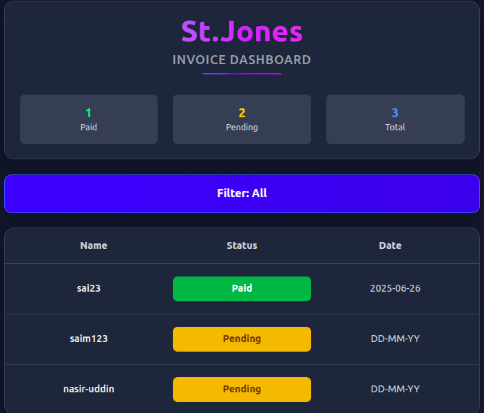

# Collectify 🏢💸 — Frontend

**Live Demo:** [https://collectify-ui.vercel.app](https://collectify-ui.vercel.app)

Collectify is a modern web application designed to automate and simplify the process of building maintenance collection. No more spreadsheets, confusion, or manual tracking — just clear, real-time financial visibility with powerful group management tools and analytics.

This repository contains the frontend built with **React + Vite**, offering a fast, responsive, and intuitive user experience.

**Backend Repo:** [CollectifyApis (Django + Gemini)](https://github.com/hamza-dev-12/CollectifyApis)

---

## 🌟 Features

- 🔐 **User Authentication** — Secure account registration and login system.
- 🏘️ **Group Management** — Create and manage buildings as groups with multiple members.
- 📊 **Payment Tracking** — Update and monitor payment status: _Paid_ or _Pending_.
- 📈 **Real-Time Analytics** — Interactive charts to visualize payment distributions.
- 💬 **Smart Chat (Natural Language Querying)** — Admins can interact with their group data using simple human language (powered by AI).

---

## 🧠 Motivation

Managing maintenance fees for residential or commercial buildings manually is error-prone and inefficient. Residents forget who paid and who didn’t, and there's often no centralized system to track these dues.

Collectify solves this problem by offering:

- Centralized group-based payment management.
- Visual insights into paid and pending amounts.
- A smart assistant to query group status effortlessly.

---

## 🚀 Tech Stack

- **Frontend:** React, Vite, TailwindCSS
- **Backend** Django, Django Rest Framework
- **Smart Assistanct**: Gemini
- **Charts:** Recharts
- **Deployment:** Vercel

---

## 📸 Preview

 <!-- Optional: Add preview screenshots -->

---

## 🛠️ Setup Instructions

```bash
# Clone the repository
git clone https://github.com/your-username/collectify-frontend.git
cd collectify-frontend

# Install dependencies
npm install

# Start the dev server
npm run dev
```
